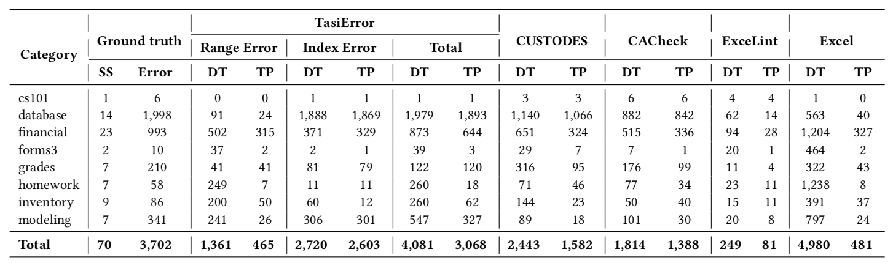

# Spreadsheet Error Dataset

The **Spreadsheet Error dataset** contains 70 spreadsheets from 8 categories, 291 worksheets and 3,072 missing formulas and formula errors (which are two types of popular spreadsheet errors). This is the dataset used by our ISSTA 2021 paper: **Semantic Table Structure Identification in Spreadsheets**.

This dataset includes three folders.

* Subject
* TasiErrorLabelTool
* Research Paper

## Subject

Folder `Subject` includes 70 spreadsheets from EUSES dataset (which is an open source spreadsheet dataset).

We also provide a statistical spreadsheet `Groundtruth and tool results.xls` to publish the groundtruth errors in each spreadsheet and the results of our approach and other six error detection tools (i.e., CUSTODES, CACheck, ExceLint, AmCheck, Excel internal detector and UCheck & Dimension).

## Label Tool

Folder `LabelTool` includes an Excel plugin `TasiErrorLabelTool` which helps to label the groundtruth errors in spreadsheets.

We also provide a readme document to help users using the plugin.

## Related Paper

Folder `Related Paper` includes the related paper to the dataset. 

 Yakun Zhang, Xiao Lv, Haoyu Dong, Wensheng Dou, Shi Han, Dongmei Zhang, Jun Wei, and Dan Ye. 2021. Semantic Table Structure Identification in Spreadsheets. In Proceedings of the 30th ACM SIGSOFT International Symposium on Software Testing and Analysis (ISSTA ’21), July 11–17, 2021, Virtual, Denmark. ACM, New York, NY, USA, 13 pages. https://doi.org/10.1145/3460319.3464812

If you use this dataset, please cite this paper.